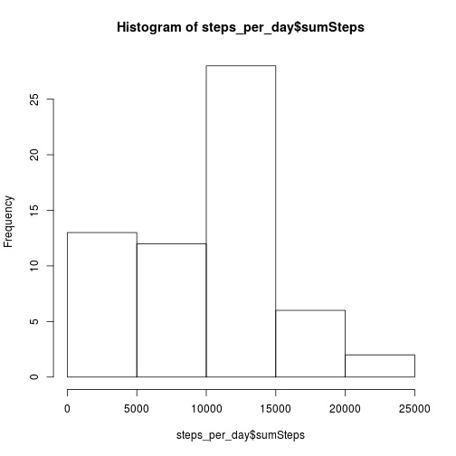
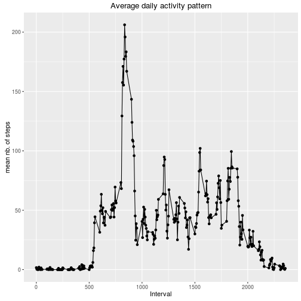
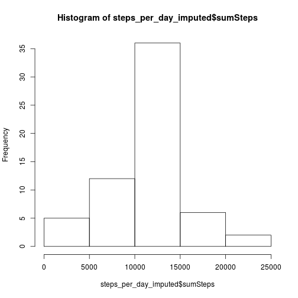
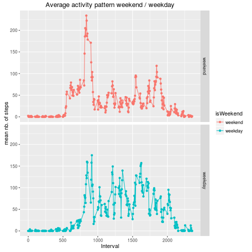

# Reproducible Research: Peer Assessment 1

-------------

## Loading and preprocessing the data

Load the following libraries: dplyr to manage data frames, ggplot2 to produce plots


```r
library(dplyr)
library(ggplot2)
```

Read activity.csv file


```r
activity <- read.csv ("activity.csv")
```

## Question: What is mean total number of steps taken per day?

Calculate the total number of steps taken per day.
*If you do not understand the difference between a histogram and a barplot, research the difference between them.*


```r
steps_per_day <- activity %>% 
                 group_by (date) %>%
                 summarise (sumSteps = sum(steps, na.rm = TRUE))
```

Make a histogram of the total number of steps taken each day.


```r
hist (steps_per_day$sumSteps)
```



Calculate and report the mean and median of the total number of steps taken per day


```r
mean (steps_per_day$sumSteps)
```

```
## [1] 9354.23
```

```r
median (steps_per_day$sumSteps)
```

```
## [1] 10395
```

## Question: What is the average daily activity pattern?

Make a time series plot (i.e. 𝚝𝚢𝚙𝚎 = "𝚕") of the 5-minute interval (x-axis) and the average number of steps taken, averaged across all days (y-axis)


```r
steps_per_minute <- activity %>% 
                 group_by (interval) %>%
                 summarise (meanSteps = mean(steps, na.rm = TRUE))

qplot (interval, meanSteps, data = steps_per_minute,
    xlab = "Interval", ylab = "mean nb. of steps",
    main = "Average daily activity pattern") +
  geom_line()
```



```r
ggsave (filename = "AverageDailyActivityPattern.png")
```

```
## Saving 7 x 7 in image
```

Which 5-minute interval, on average across all the days in the dataset, contains the maximum number of steps?


```r
maxIndex <- which(steps_per_minute$meanSteps == max(steps_per_minute$meanSteps))
steps_per_minute$meanSteps[maxIndex]
```

```
## [1] 206.1698
```

```r
# Result 206.1698
```

## Imputing missing values

Note that there are a number of days/intervals where there are missing values (coded as 𝙽𝙰). The presence of missing days may introduce bias into some calculations or summaries of the data.

Calculate and report the total number of missing values in the dataset (i.e. the total number of rows with 𝙽𝙰s)


```r
table(is.na(activity$steps))
```

```
## 
## FALSE  TRUE 
## 15264  2304
```

Devise a strategy for filling in all of the missing values in the dataset. The strategy does not need to be sophisticated. For example, you could use the mean/median for that day, or the mean for that 5-minute interval, etc.

*I will use the mean for that 5-minute interval, taking advantage of the steps_per_minute dataframe that I created before.*

Create a new dataset that is equal to the original dataset but with the missing data filled in.


```r
activity_imputed <- activity %>%
                    mutate(steps = replace(steps, is.na(steps), steps_per_minute$meanSteps))
```

Make a histogram of the total number of steps taken each day and Calculate and report the mean and median total number of steps taken per day. Do these values differ from the estimates from the first part of the assignment? What is the impact of imputing missing data on the estimates of the total daily number of steps?


```r
steps_per_day_imputed <- activity_imputed %>% 
                 group_by (date) %>%
                 summarise (sumSteps = sum(steps, na.rm = TRUE))
hist (steps_per_day_imputed$sumSteps)
```



Calculate and report the mean and median of the total number of steps taken per day


```r
mean (steps_per_day_imputed$sumSteps)
```

```
## [1] 10766.19
```

```r
# Result 10766.19
median (steps_per_day_imputed$sumSteps)
```

```
## [1] 10766.19
```

```r
# Result 10766.19
```

## Are there differences in activity patterns between weekdays and weekends?

For this part the 𝚠𝚎𝚎𝚔𝚍𝚊𝚢𝚜() function may be of some help here. Use the dataset with the filled-in missing values for this part.

Create a new factor variable in the dataset with two levels – “weekday” and “weekend” indicating whether a given date is a weekday or weekend day.


```r
wdays <- weekdays (as.Date (activity$date, "%Y-%m-%d"))
wdays_is_weekend <- wdays == "Saturday" | wdays == "Sunday"
activity$isWeekend <- factor (wdays_is_weekend, labels = c("weekend", "weekday"))
```

Make a panel plot containing a time series plot (i.e. 𝚝𝚢𝚙𝚎 = "𝚕") of the 5-minute interval (x-axis) and the average number of steps taken, averaged across all weekday days or weekend days (y-axis). See the README file in the GitHub repository to see an example of what this plot should look like using simulated data.


```r
steps_per_minute_isWeekend <- activity %>% 
                 group_by (interval,isWeekend) %>%
                 summarise (meanSteps = mean(steps, na.rm = TRUE))

qplot (interval, meanSteps, data = steps_per_minute_isWeekend,
    xlab = "Interval", ylab = "mean nb. of steps",
    main = "Average activity pattern weekend / weekday", colour = isWeekend) +
  facet_grid(isWeekend ~ .) +
  geom_line()
```



```r
ggsave (filename = "AverageActivityPattern_WeekendWeekday.png")
```

```
## Saving 7 x 7 in image
```

